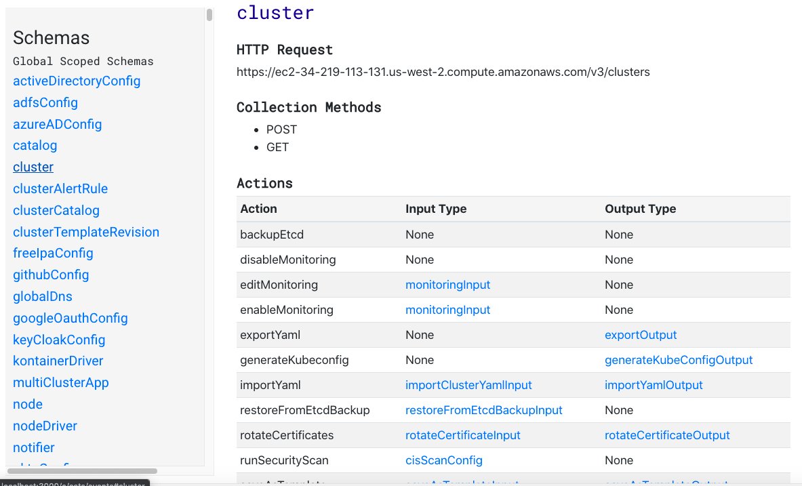
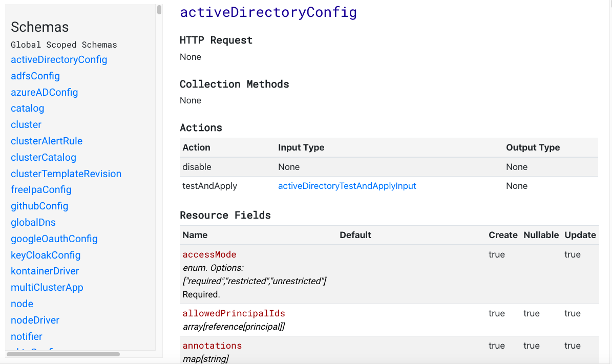

This project is intended to be a proof of concept to see if we can auto-generate documentation for the Rancher API. The relevant issue in the rancher/docs repo is here: https://github.com/rancher/docs/issues/1587

I was successfully able to auto-generate lists of the fields for each resource. The resources are organized by scope: global, cluster, or project. The docs also indicate required fields.

## Screenshots of Work in Progress

### Schema with Collection Methods



### Type Showing Required Fields




## How it Works

For development purposes, I have taken the data from a Rancher server and downloaded the API information as JSON, and used the offline JSON source to build these docs. This is the equivalent of what is available from the Rancher API view.

The API's JSON schema output is in these files:

- `clusterSchemas.js`
- `globalSchemas.js`
- `projectSchemas.js`

All of the logic to generate this documentation is in `App.js.`

I had to stop working on this project because I was assigned to work on other things as a higher priority. With that said, I would like to finish it in 2021.


## Running the App

To run this project, clone the repo and run:

```
npm install
npm start
```

The app runs on `http://localhost:3000/`.

## Plans

Eventually I would like to allow this project to connect to a live Rancher server and display API documentation for that particular server. It would be nice if it could take a Rancher server URL and a bearer token, then show what operations the token has access to.

The API docs will need to include these sections at a minimum:

### Basics

- Use the API in the Browser
- Get API Keys
- Make Requests
- Levels of Scope

### Examples

- Set up a Rancher Server
- Change Settings
- Create a Custom Cluster
- Set up a Registered Cluster
- RBAC
- Authentication
- Node Templates
- Cloud Credentials

There is also more detailed information that can be gleaned from the JSON schema by using this document: https://github.com/rancher/api-spec/blob/master/specification.md#schemas All of those details also need to be incorporated into the API docs.